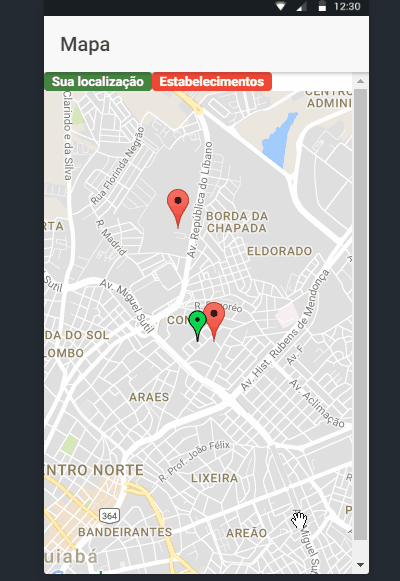

# ionic3-googleMaps
A simple example showing its location and some points around it

1) Create project or use existing one in [Google Developer Console](https://developers.google.com/);

In the list of Dashboard APIs, look for the Google Maps Distance Matrix API, Google Maps Javascript API, Google Maps Geolocation API and activate the 3;

2) Install the dependencies:
> npm i

3) Run the project
> ionic serve -l

## Establishments around me

Center the map with your location;

List establishments passed in an array with multiple objects;

Adds the marker to each object in the array, by latitude and longitude;

When clicking on the marker, it opens a pop-up with the name of the establishment;

